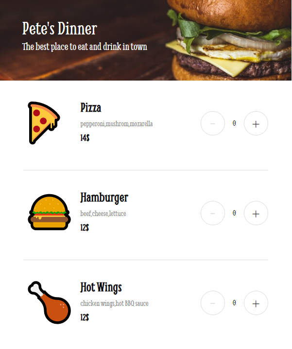
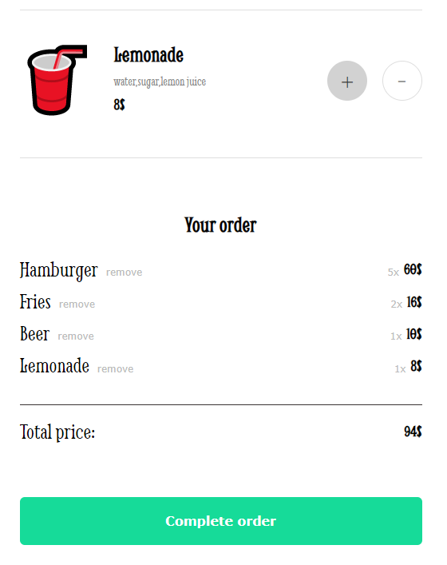
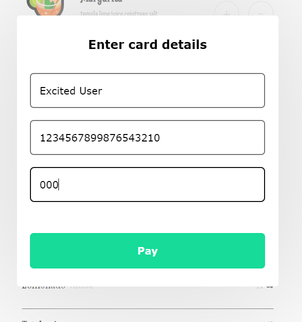
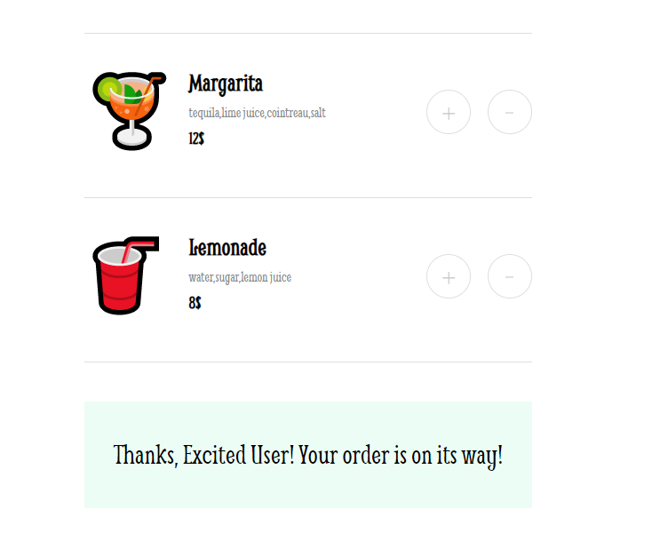

# Scrimba - The Frontend Developer Carrer Path - Module 5 - Restaurant Ordering app project

Hello and welcome! Thank you for stopping by.🤠

This is a solution to the Restaurant Ordering app project from _Module 5 - Essential JavaScript concepts_ of the [The Frontend Career Path](https://scrimba.com/learn/frontend).

## Table of contents

- [Overview](#overview)
  - [The project](#the-challenge)
  - [How to use the app](#how-to-use-the-app)
  - [Screenshot](#screenshot)
  - [Links](#links)
- [My process](#my-process)
  - [Built with](#built-with)
  - [What I learned](#what-i-learned)
  - [Continued development](#continued-development)
- [Author](#author)
- [Acknowledgments](#acknowledgments)
- [About Scrimba](#about-scrimba)

## Overview

### The project

_Disclaimer: The layout is still static and it's set for at least 600px width screenview._

The Ordering app allows users to do the following:

- View a menu of available food items
- Add food items to a cart
- Remove food items from the cart
- Place an order and receive an confirmation message

### How to use the app

To order food using the Ordering App, follow these steps:

1. Navigate to the home page at https://petrvalenta92.github.io/ordering-app/.
2. View the menu of available food items.
3. Click the "Plus" button next to the items you want to order.
4. Adjust the quantity of each item in your cart with "Plus" and "Minus" buttons as desired.
5. Remove any unwanted items from your cart by clicking the "Remove" button next to them.
6. Click the "Complete Order" button.
7. Fill out the order form with your payment information.
8. Click the "Pay" button to place your order.

### Screenshot

Home page - Menu (600px by default)

Checkout

Payment Form

Payment Form

### Links

- Solution URL: [Github Repository](https://github.com/PetrValenta92/ordering-app)
- Live Site URL: [Github Pages](https://petrvalenta92.github.io/ordering-app/)

## My process

### Built with

- Semantic HTML5 markup
- Modal
- Forms
- CSS custom properties
- CSS pseudoclasses
- Flexbox
- Vanilla JavaScript

### What I learned

I built the project based on the provided design Figma template. First I have had prepared the HTML and CSS part of the app on which I was able to practice my knowledge of semantic HTML5 and CSS. For easier work with layout I used Flexbox several times. Also I used the custom properties for easier work with colors and its oppacity. For the buttons I have used different pseudoclasses to enrich the user's experience.
Then I wrote the JavaScript part of the app. There I used mostly the new knowledge which I have had learned from _Module 5 - Essential JavaScript concepts_

### Continued development

In the future I'd like to update the layout to be responsive! Also I would like to get involved with possible "meal deal" offers. A discount will appear based on combinations of meals ordered. I would also like to link the app to a local database. This will store orders, assign them identification numbers, collect customer information and then offer them the same meals as the last order.

## Author

- Website - _to be added..._
- GitHub - [@PetrValenta92](https://github.com/PetrValenta92)
- LinkedIn - [@valentapetr](https://www.linkedin.com/in/valentapetr/)
- Instagram - [@petr.codes](https://www.instagram.com/petr.codes/)

## Acknowledgments

I would love to thank whole [Scrimba](https://scrimba.com) team for such amazing project they have created. I want to thank the Scrimba community and specialy the [Junior Guru Community](https://junior.guru/) community! 🐣

## About Scrimba

At Scrimba our goal is to create the best possible coding school at the cost of a gym membership! 💜
If we succeed with this, it will give anyone who wants to become a software developer a realistic shot at succeeding, regardless of where they live and the size of their wallets 🎉
The Frontend Developer Career Path aims to teach you everything you need to become a Junior Developer, or you could take a deep-dive with one of our advanced courses 🚀

- [Our courses](https://scrimba.com/allcourses)
- [The Frontend Career Path](https://scrimba.com/learn/frontend)
- [Become a Scrimba Pro member](https://scrimba.com/pricing)

Happy Coding!
